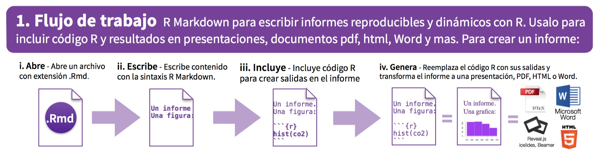
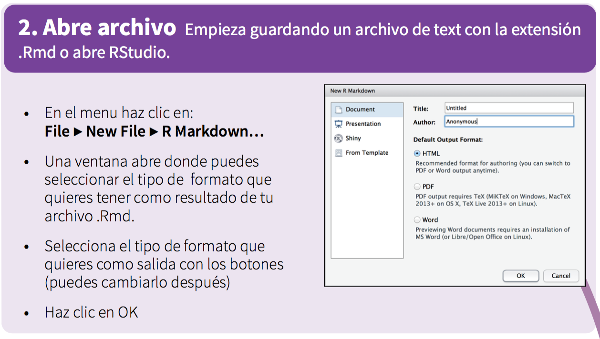
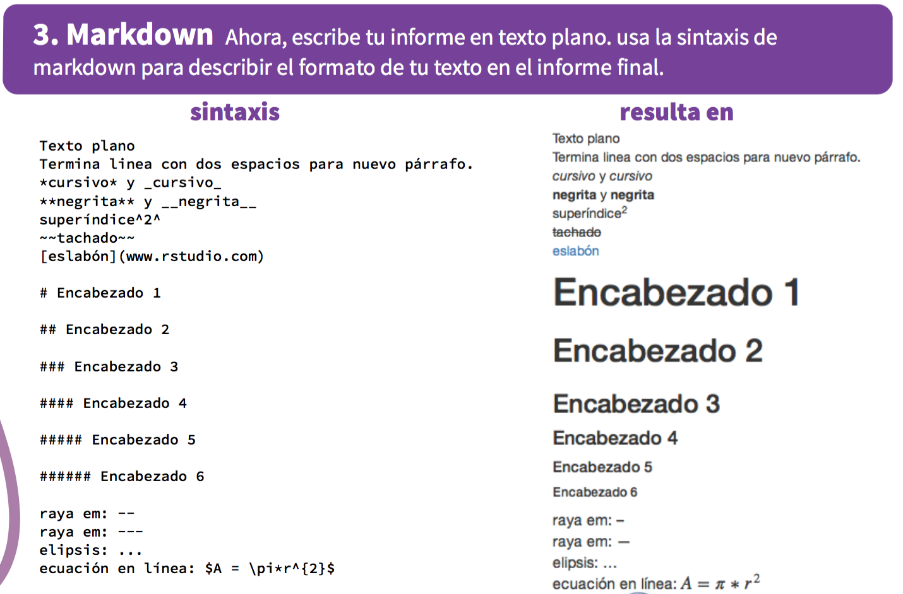
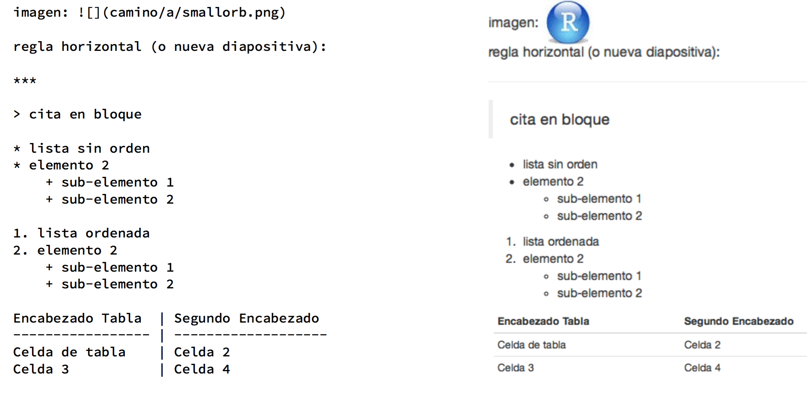

<style type="text/css">
body {background:grey transparent;
}
</style>


## Reportes dinámicos
> - La forma tradicional de escribir reportes es producir los gráficos en un software como `R` y guardarlos en formato `PDF` o `PNG`. Posteriormente se incluye en un editor (o de composición) de textos estos gráficos en conjunto con la descripción de sus resultados.
.
> - Un reporte realizado de esta manera puede causar problemas ya que si los análisis se realizan con un conjunto más pequeño de los datos, el reporte tiene que rehacerse siguiendo los mismos pasos.
> - Un documento, por lo tanto, es dinámico si contiene código y la narrativa de las figuras, tablas, etc. Si los datos cambian, simplemente ejecutamos de nuevo el programa para obtener un nuevo documento.

> - Los reportes dinámicos permiten de igual forma obtener reportes reproducibles si se comparte de igual forma los códigos y los datos utilizados. 


--- .class #id 

## Reportes dinámicos en `R`.

> - R permite generar reportes dinámicos utilizando los paquetes `markdown`, `rmarkdown` y `knitr`.
> - Los reportes generados en `rmarkdown` pueden ser de tipo `PDF`, `Word`, `html`, `markdown`, etc.
> - Para generar estos reportes es necesario ejecutar en la consola de `R`, el comando 

> - ```{r, eval=FALSE} 
ìnstall.packages(c("rmarkdown", "knitr"), dependencies = TRUE)
``` 
> - Usualmente, `RStudio` instala por defecto los paquetes `rmarkdown` y `knit`. Si este es el caso, entonces simplemente cargamos los paquetes usando `library(c(rmarkdown, knitr))`

--- .segue bg:grey

## R Markdown

---


## R Markdown (mecánica de generación)
- Flujo de trabajo:

```{r  echo=FALSE, out.width = "100%"}
 
```

- `RStudio` contiene un sólo botón que realiza todas estas tareas y produce un documento como resultado.

--- .class #id 

## R Markdown (Empezando con `RStudio`)
- Flujo de trabajo:

```{r  echo=FALSE, out.width = "80%", fig.align='center'}
 
```

--- .class #id 

## R Markdown (sintaxis)

```{r  echo=FALSE, out.width = "80%", fig.align='center'}
 
```

--- .class #id

## R Markdown (sintaxis), cont.

```{r  echo=FALSE, out.width = "90%", fig.align = 'center'}
 
```

--- .class #id 

## R Markdown (definición del encabezado YAML)

```{r  echo=FALSE, out.width = "75%", fig.align='center'}
include_graphics("./assets/img/yaml.PNG") 
```

--- .class #id 


## R Markdown (inserción de código)

```{r  echo=FALSE, out.width = "75%", fig.align='center'}
include_graphics("./assets/img/chunk.PNG") 
```

--- .class #id 


## R Markdown (opciones de código)

```{r  echo=FALSE, out.width = "75%", fig.align='center'}
include_graphics("./assets/img/options.PNG") 
```

--- .class #id 


## R Markdown (finalmente genera el documento)

```{r  echo=FALSE, out.width = "90%", fig.align='center'}
include_graphics("./assets/img/generate.PNG") 
```

--- .segue bg:grey

## Elementos interactivos

---

## Paquetes que mejoran la estética del documento

- Paquetes como `highcharter`, `tutorial`, `rCharts`, `dygraphs`, `iquiz`, `prettydoc` mejoran significativamente la estética del documento final, siempre y cuando el documento generado sea en formato `HTML`.

- Para el caso de los documentos `PDF`, éstos se pueden incluir, sin embargo, se pierde la interacción con el reporte.

- Ahora iniciemos creando un documento en `R Markdown`.


--- .class #id


